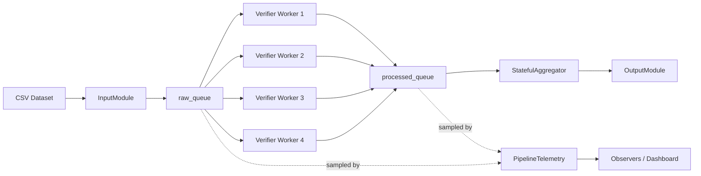
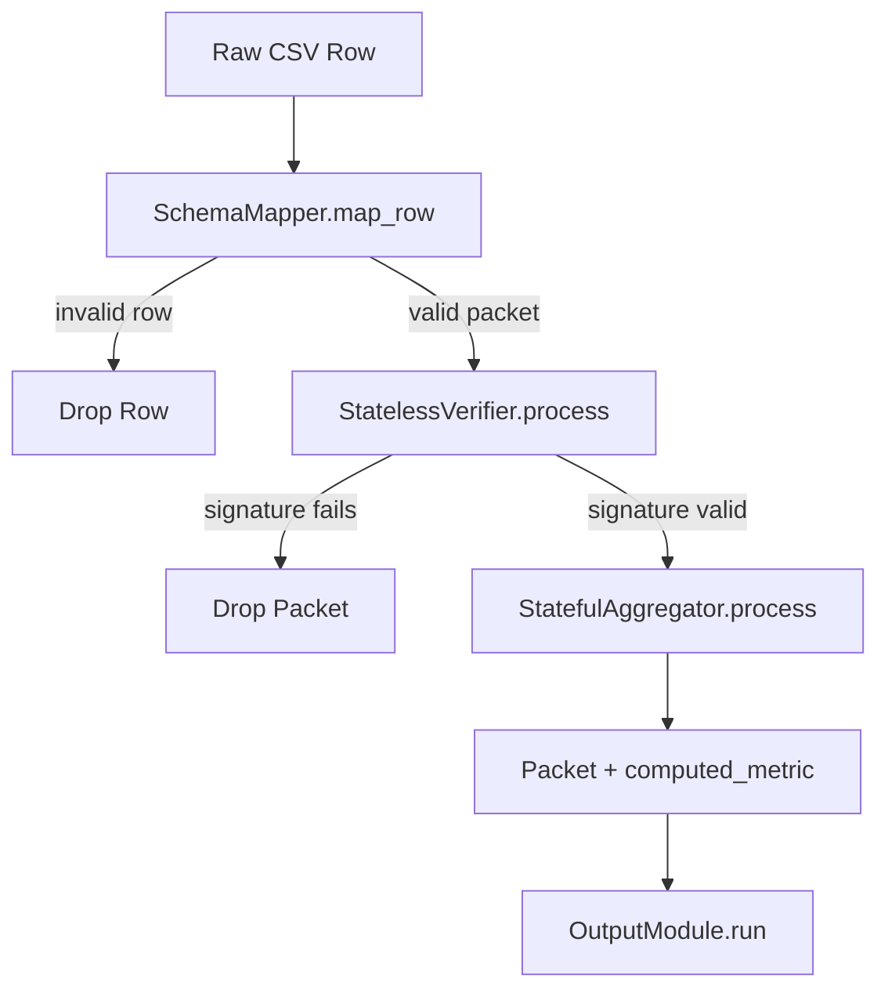
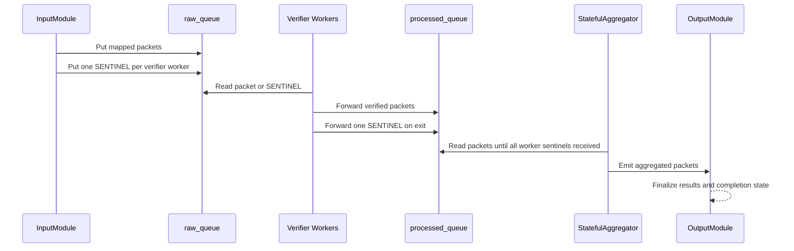
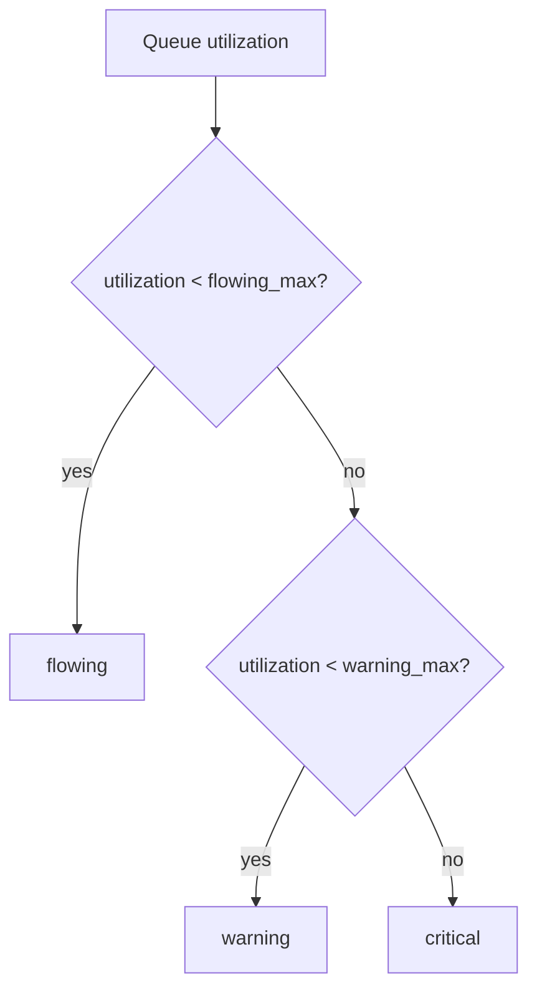
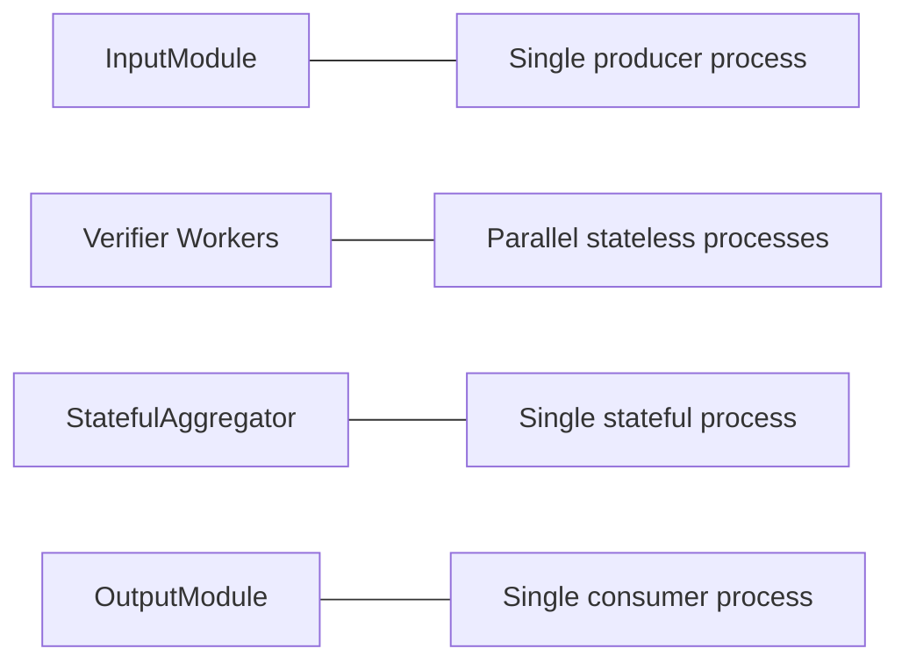

# Phase 3 Complete Guide

## 1. Purpose

Phase 3 extends the project from a single-process GDP analysis flow into a generic concurrent packet pipeline.

It adds:

1. Schema-driven ingestion.
2. Parallel stateless verification.
3. Stateful sliding-window aggregation.
4. Queue telemetry and backpressure classification.
5. Output-stage consumption.
6. CLI execution through `main.py --phase3`.
7. Streamlit integration through the `Sensor Pipeline` view.

The design is generic. The pipeline operates on internal packet keys such as `entity_name`, `time_period`, `metric_value`, and `security_hash` instead of hardcoding sensor-specific logic in every stage.

## 2. Completion Status

All Phase 3 parts are complete.

1. Part 1: scaffold package and interfaces.
2. Part 2: config and `main.py` wiring.
3. Part 3: input module implementation.
4. Part 4: stateless verifier.
5. Part 5: stateful aggregator.
6. Part 6: multiprocessing orchestrator.
7. Part 7: telemetry `poll_once()`.
8. Part 8: output module `run()`.
9. Part 9: architecture/design artifact.
10. Part 10: diagram artifact.
11. Part 11: validation artifact.
12. Part 12: final documentation pass.

## 3. Phase 3 Files

### Code Files

1. `proj/phase3/__init__.py`
2. `proj/phase3/contracts.py`
3. `proj/phase3/input_module.py`
4. `proj/phase3/core_module.py`
5. `proj/phase3/telemetry.py`
6. `proj/phase3/output_module.py`
7. `proj/phase3/orchestrator.py`

### Documentation Files

1. `proj/phase3/README.md`
2. `proj/docs/phase3/README.md`
3. `proj/docs/phase3/PHASE3_COMPLETE_GUIDE.md`

### Historical Root-Level Phase 3 Docs

1. `PHASE3_EXPLAINED.md`
2. `PHASE3_DIAGRAMS.md`
3. `PHASE3_VALIDATION.md`
4. `PHASE3_FINAL.md`

This guide consolidates the content of those root-level Phase 3 docs into one document under `proj/docs/phase3`.

## 4. Configuration Summary

Phase 3 is configured in `proj/config.json`.

Current key values:

1. Dataset path: `../Everything/Project/Phase 3/sample_sensor_data.csv`
2. Input delay: `0.01` seconds
3. Core parallelism: `4`
4. Queue max size: `50`
5. Verifier algorithm: `pbkdf2_hmac`
6. Iterations: `100000`
7. Secret key: `sda_spring_2026_secure_key`
8. Aggregation window size: `10`

Schema mapping:

1. `Sensor_ID -> entity_name`
2. `Timestamp -> time_period`
3. `Raw_Value -> metric_value`
4. `Auth_Signature -> security_hash`

## 5. Internal Data Model

Each mapped packet uses this internal shape:

```python
{
    "entity_name": str,
    "time_period": int,
    "metric_value": float,
    "security_hash": str,
}
```

After aggregation the packet becomes:

```python
{
    "entity_name": str,
    "time_period": int,
    "metric_value": float,
    "security_hash": str,
    "computed_metric": float,
}
```

## 6. Component Responsibilities

### `phase3/contracts.py`

Defines the Phase 3 contracts:

1. `GenericInputModule`
2. `GenericCoreModule`
3. `GenericOutputModule`
4. `TelemetryObserver`
5. `PipelineTelemetrySubject`
6. `PacketProcessor`

### `phase3/input_module.py`

Input-side responsibilities:

1. Read CSV input rows.
2. Map external column names to internal packet fields.
3. Cast values according to the configured schema.
4. Push valid packets to the raw queue.
5. Push sentinels when input is exhausted.

Important types:

1. `ColumnSchema`
2. `InputModuleConfig`
3. `SchemaMapper`
4. `InputModule`

### `phase3/core_module.py`

Core-stage responsibilities:

1. Verify packet signatures.
2. Drop invalid packets.
3. Compute the sliding-window average for valid packets.

Important types:

1. `CoreModuleConfig`
2. `StatelessVerifier`
3. `StatefulAggregator`

### `phase3/telemetry.py`

Telemetry responsibilities:

1. Measure queue size and capacity.
2. Compute queue utilization.
3. Classify queue state as `flowing`, `warning`, or `critical`.
4. Publish queue snapshots to observers.

Important types:

1. `TelemetryThresholds`
2. `PipelineTelemetry`

### `phase3/output_module.py`

Output-stage responsibilities:

1. Consume aggregated packets.
2. Store output results in runtime state.
3. Track consumed count and last packet.
4. Emit per-packet and completion notifications when an observer is configured.

Important types:

1. `OutputModuleConfig`
2. `OutputModule`

### `phase3/orchestrator.py`

Orchestration responsibilities:

1. Create bounded queues.
2. Start the input process.
3. Start N verifier worker processes.
4. Start the single aggregator process.
5. Join all processes.
6. Collect run summary data.
7. Print final CLI summary.

Important types and functions:

1. `OrchestratorConfig`
2. `PipelineOrchestrator`
3. `_run_input_stage(...)`
4. `_run_verifier_worker(...)`
5. `_run_aggregator_stage(...)`

## 7. Architectural Decisions

### Why Verification Is Parallel

Verification is the expensive stage because PBKDF2-HMAC with 100,000 iterations is intentionally costly.

This makes the split practical:

1. Input stage: light work.
2. Verification stage: heavy but independent per packet.
3. Aggregation stage: light but stateful.

### Why Aggregation Is Single-Process

The sliding window is shared state. If multiple processes mutated the same window, correctness would become much harder to guarantee.

Keeping aggregation single-owner preserves correctness and keeps ordering logic simple.

### Why Sentinels Are Used

A sentinel value (`None`) is used to terminate downstream stages deterministically.

Shutdown sequence:

1. Input emits one sentinel per verifier worker.
2. Each verifier worker forwards one sentinel to the processed queue when exiting.
3. The aggregator counts worker sentinels.
4. The aggregator exits after all expected sentinels are received.

## 8. Runtime Flow

### Text Flow

1. `InputModule` reads a CSV row.
2. `SchemaMapper` converts the row into the internal packet format.
3. The packet is pushed into `raw_queue`.
4. Parallel verifier workers consume packets from `raw_queue`.
5. Invalid packets are dropped.
6. Valid packets are pushed into `processed_queue`.
7. `StatefulAggregator` consumes valid packets and adds `computed_metric`.
8. Output results are stored and summarized.
9. Telemetry can sample queues and classify queue health.

### Diagram: Pipeline Structure



### Diagram: Packet Lifecycle



### Diagram: Shutdown Flow



### Diagram: Telemetry States



### Diagram: Concurrency Boundaries



## 9. Telemetry Model

Per-queue telemetry fields:

1. `size`
2. `capacity`
3. `utilization`
4. `state`

Classification rules:

1. `flowing`: utilization below `flowing_max`
2. `warning`: utilization between `flowing_max` and `warning_max`
3. `critical`: utilization at or above `warning_max`

A snapshot also includes:

1. `overall_state`
2. `thresholds.flowing_max`
3. `thresholds.warning_max`

## 10. Output Model

The output stage stores runtime information in a shared runtime dictionary.

Important runtime fields:

1. `results`
2. `consumed`
3. `last_packet`
4. `completed`
5. `observer`
6. `processed_queue`
7. `worker_count`

Observer events used by `OutputModule`:

1. `output_update`
2. `output_complete`

## 11. Dashboard Integration

Phase 3 is integrated into the Streamlit dashboard as `Sensor Pipeline`.

Supported dashboard behavior:

1. Start continuous pipeline.
2. Stop the pipeline.
3. Reset pipeline state.
4. Live counters and chart updates.
5. Cached session-state result rendering.
6. Queue telemetry visualization.

## 12. CLI Usage

Run the CLI pipeline:

```bash
cd proj
python main.py --phase3
```

Expected behavior:

1. The dataset is processed.
2. A completion summary prints to the console.
3. `PipelineOrchestrator.last_run` stores the run summary.

Representative observed result:

1. `Packets seen: 200`
2. `Verified: 200`
3. `Dropped: 0`
4. `Final avg: 33.242`

## 13. Dashboard Usage

Run the dashboard:

```bash
cd proj
python main.py
```

Then:

1. Open the Streamlit UI.
2. Select `Sensor Pipeline` from the sidebar.
3. Use `Start Continuous Pipeline`, `Stop`, and `Reset`.

## 14. Validation Summary

### Syntax Validation

The following modules were compile-checked successfully:

1. `proj/phase3/contracts.py`
2. `proj/phase3/input_module.py`
3. `proj/phase3/core_module.py`
4. `proj/phase3/telemetry.py`
5. `proj/phase3/output_module.py`
6. `proj/phase3/orchestrator.py`
7. `proj/gdp_dashboard_streamlit.py`

### Functional Smoke Tests

Verifier and aggregator smoke test:

1. First 5 rows verified successfully.
2. No drops for the tested rows.
3. Rolling averages updated correctly.

Representative rolling averages observed:

1. `24.99`
2. `34.645`
3. `32.21`
4. `29.425`
5. `28.302`

### Full Orchestrator Runtime Test

Observed result:

1. `Phase 3 pipeline complete.`
2. `Packets seen: 200`
3. `Verified: 200`
4. `Dropped: 0`
5. `Final avg: 33.242`

### Telemetry Snapshot Test

Test setup:

1. Queue `raw` at `3/10`
2. Queue `processed` at `9/10`

Observed result:

1. `raw -> flowing`
2. `processed -> critical`
3. `overall_state -> critical`

### Output Module Test

Observed result:

1. `completed = True`
2. `consumed = 2`
3. `len(results) = 2`
4. `last_packet.packet_no = 2`

### Dashboard Validation

Observed behavior:

1. Streamlit booted successfully.
2. Phase 3 dashboard route loaded.
3. Continuous pipeline controls worked.
4. Session-state result rendering remained stable.

## 15. Acceptance Checklist

1. Input module reads and maps the dataset.
2. Stateless verifier validates signatures.
3. Stateful aggregator computes the running average.
4. Orchestrator starts and joins multiprocessing stages.
5. Telemetry returns queue-state snapshots.
6. Output module consumes processed packets.
7. CLI execution through `main.py --phase3` completes.
8. Dashboard integration launches and runs.

All checklist items have been satisfied.

## 16. Known Constraints

1. Queue telemetry is validated independently and is not yet deeply integrated into the CLI orchestrator output path.
2. The current orchestrator stores aggregated results directly through shared state rather than routing through `OutputModule` as the final live process stage.
3. The root-level Phase 3 docs remain in place as historical source artifacts, but this file is the consolidated reference under `proj/docs/phase3`.

## 17. Recommended Follow-Up Improvements

If the project continues beyond the assignment, the most natural follow-up improvements are:

1. Route the CLI orchestrator through `OutputModule` as the final live process stage.
2. Integrate `PipelineTelemetry` directly into the CLI orchestration loop.
3. Add automated tests for queue telemetry and orchestrator shutdown behavior.

## 18. Final Summary

Phase 3 is complete as a delivered implementation and documentation package.

It now provides:

1. Schema-driven ingestion.
2. Parallel signature verification.
3. Stateful sliding-window aggregation.
4. Queue telemetry classification.
5. Output-stage consumption.
6. CLI execution.
7. Streamlit dashboard integration.
8. Architecture explanation.
9. Diagrams.
10. Validation evidence.
11. Final handoff documentation.
